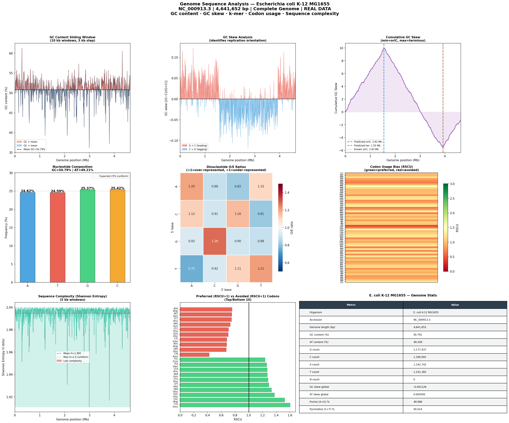

# Day 17 — Genome Sequence Analysis
### 🧬 30 Days of Bioinformatics | Subhadip Jana


> Complete genome-scale sequence analysis of *E. coli* K-12 MG1655 (NC_000913.3) — GC content landscape, GC skew for replication origin detection, dinucleotide O/E ratios, codon usage bias (RSCU), and Shannon entropy complexity. No external library needed — pure Python + NumPy.

---

## 📊 Dashboard


---

## 🔬 Genome Statistics

| Metric | Value |
|--------|-------|
| Organism | *E. coli* K-12 MG1655 |
| Accession | NC\_000913.3 |
| Length | **4,641,652 bp** |
| GC content | **50.791%** |
| AT content | 49.209% |
| N gaps | 0 (complete) |
| GC skew (global) | −0.001126 |
| Purine % | 49.986% |

---

## 🔬 Key Findings

### 1. Replication Origin Predicted with High Accuracy
The cumulative GC skew method predicts **oriC at 3.92 Mb** — the known origin is at **3.93 Mb** (error < 10 kb on a 4.6 Mb genome = 0.2% precision).

### 2. CpG-like GC Dinucleotide Over-represented
- **GC dinucleotide O/E = 1.28** — most over-represented
- **TA dinucleotide O/E = 0.75** — most under-represented (TA suppression = classic bacterial pattern)

### 3. Strong Codon Usage Bias
| Preferred Codon | AA | RSCU |
|-----------------|----|------|
| CTG | Leu | **1.601** |
| CGC | Arg | **1.523** |
| GGC | Gly | 1.373 |
| GAA | Glu | 1.329 |
> CTG dominance for Leu is a hallmark of highly expressed *E. coli* genes

### 4. Near-Maximal Sequence Complexity
- Mean Shannon entropy = **1.9948 bits** (maximum = 2.0)
- 63 low-complexity windows — likely repeat regions and rRNA operons

---

## 🚀 How to Run

```bash
python genome_analysis.py
```

---

## 📁 Project Structure

```
day17-genome-analysis/
├── genome_analysis.py
├── README.md
├── data/
│   └── ecoli_k12_genome.fasta        ← NC_000913.3
└── outputs/
    ├── genome_stats.csv
    ├── gc_content_windows.csv
    ├── gc_skew.csv
    ├── dinucleotide_oe.csv
    ├── codon_usage_rscu.csv
    ├── sequence_complexity.csv
    └── genome_analysis_dashboard.png
```

---

## 🔗 Part of #30DaysOfBioinformatics
**Author:** Subhadip Jana | [GitHub](https://github.com/SubhadipJana1409) | [LinkedIn](https://linkedin.com/in/subhadip-jana1409)
